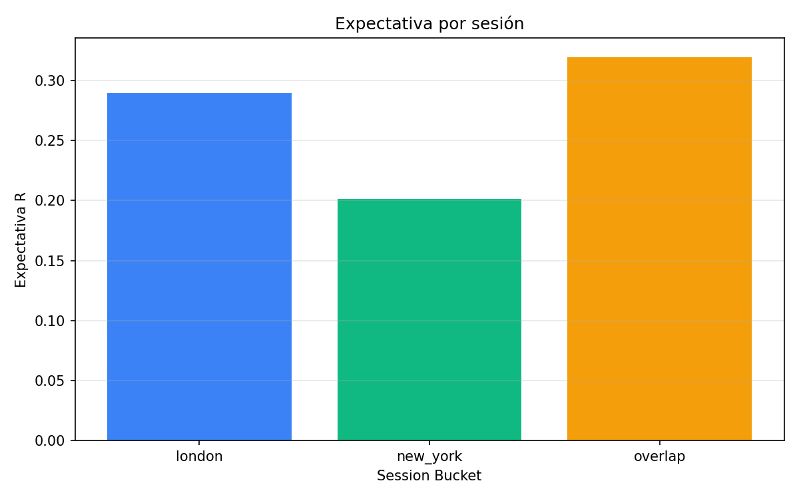
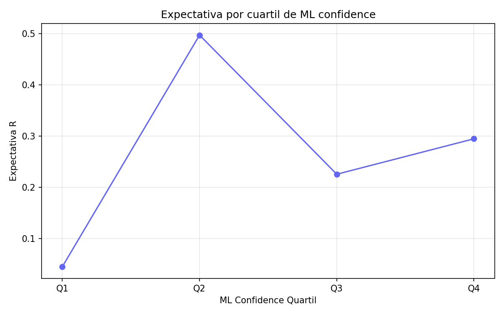
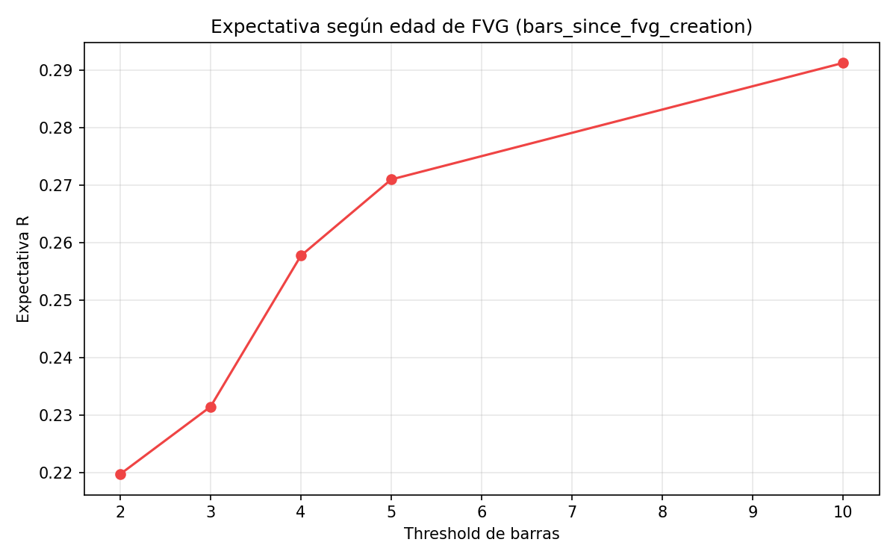
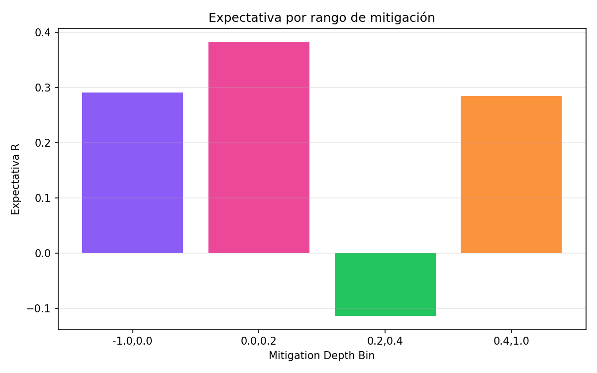
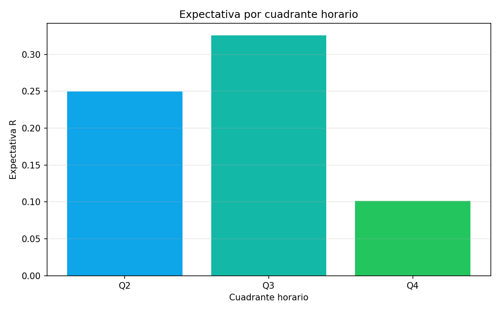
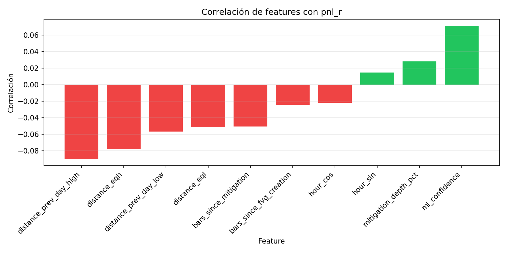
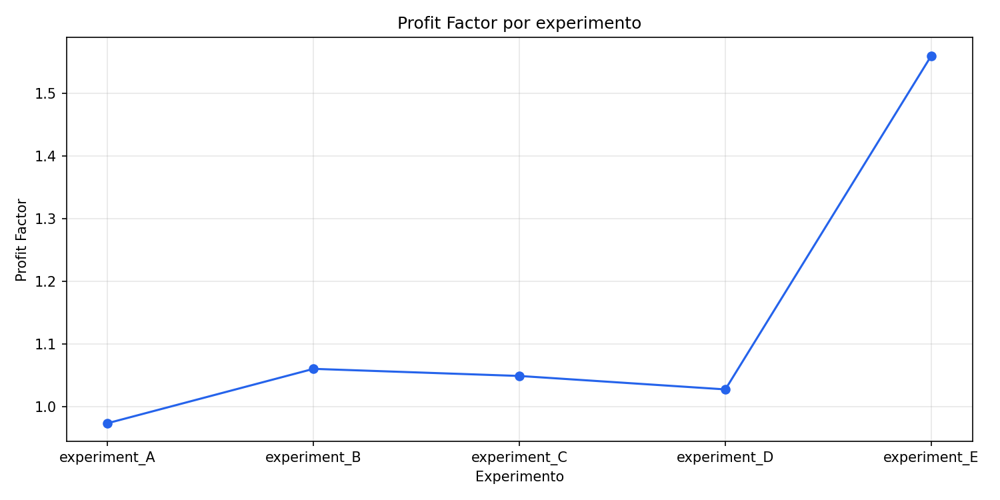
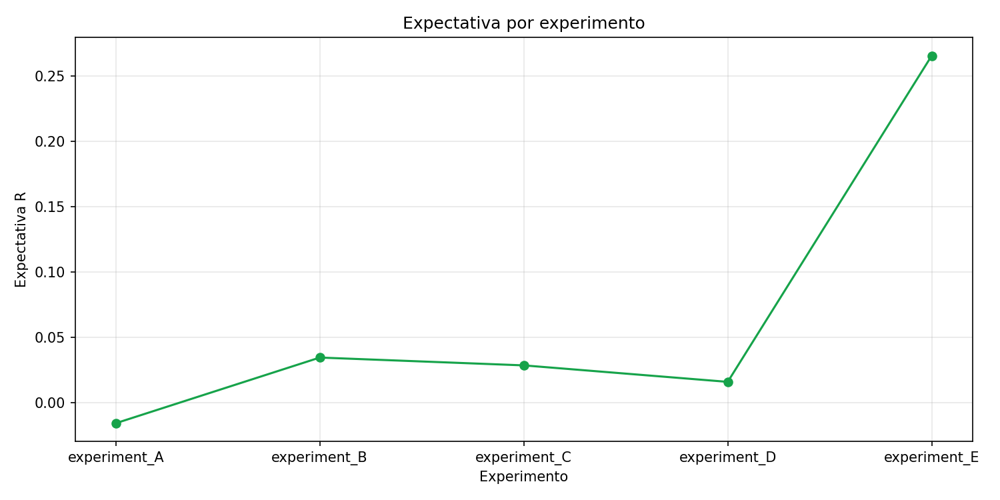

# Edge Decomposition Report

Este informe resume el análisis cuantitativo de los componentes de edge para el Experimento E y documenta las gráficas generadas desde `results/experiment_E.csv`.

## 1. Resumen del dataset
- Fuente: `results/experiment_E.csv`
- Trades: `1776`
- Expectativa promedio: `0.2655 R`
- Profit factor: `1.5605`
- Win rate: `43.19%`
- Estructura: `structure_event = bos` en el 100%
- OB: `ob_state = none` en el 100%

## 2. Componentes de edge analizados

### 2.1 Sesión
- `overlap`: expectativa `0.3196 R`
- `london`: expectativa `0.2895 R`
- `new_york`: expectativa `0.2014 R`



> La sesión es un factor diferencial relevante. El overlap combina mejor resultado con el mayor rendimiento esperado.

### 2.1.1 BOS en el experimento E
- En `experiment_E.csv`, `structure_event = bos` es constante al `100%`.
- Esto significa que en E no hay variabilidad para medir BOS internamente.

> Conclusión: en este experimento no podemos atribuir edge a BOS dentro de E. Solo podemos decir que E está construido sobre BOS.

### 2.1.2 Evidencia indirecta de BOS en Experimentos anteriores
- `experiment_A.csv`: BOS trades `n=28551`, `PF=1.0416`, `exp=0.0245 R`
- `experiment_B.csv`: BOS trades `n=3699`, `PF=4.0325`, `exp=0.9937 R`
- `experiment_A/B` muestran que el grupo BOS tiene una PF muy superior al grupo sin BOS.

> Esto sugiere que BOS es un filtro estructural relevante, pero debe confirmarse con una ablación más precisa de FVG vs FVG+ BOS.

### 2.2 ML confidence
- Rango observado: `0.8061 – 0.8930`
- Cuartiles de `ml_confidence`:
  - Q1: `0.0450 R`
  - Q2: `0.4969 R`
  - Q3: `0.2254 R`
  - Q4: `0.2946 R`




> El filtro ML agrega valor como refinamiento de calidad, pero su efecto es limitado porque la muestra ya se encuentra en la porción alta de confianza.

### 2.3 Edad del FVG
- `bars_since_fvg_creation <= 2`: `0.2197 R`
- `<= 5`: `0.2710 R`
- `<= 10`: `0.2913 R`



> El FVG aporta contexto de timing: trades más frescos tienden a mantener expectativa positiva, aunque la presencia binaria de FVG sola no garantiza edge.

### 2.4 Mitigación
- `(-1.0, 0.0]`: `0.2906 R`
- `(0.0, 0.2]`: `0.3827 R`
- `(0.2, 0.4]`: `-0.1136 R`
- `(0.4, 1.0]`: `0.2847 R`



> La mitigación es probablemente el núcleo del sistema. Una mitigación ligera positiva valida la estructura y maximiza la expectativa.

> Cuando la mitigación es demasiado profunda (`0.2–0.4`), la expectativa cae a negativa, lo que sugiere que ese rango puede destruir el edge.

### 2.5 Hora del día
- Q2: `0.2494 R`
- Q3: `0.3259 R`
- Q4: `0.1013 R`



> El cuadrante horario impacta la expectativa. La ventana Q3 muestra el mayor rendimiento esperado.

### 2.6 Correlaciones de feature con `pnl_r`
- `ml_confidence`: `+0.071`
- `mitigation_depth_pct`: `+0.028`
- `bars_since_fvg_creation`: `-0.024`
- `distance_prev_day_high`: `-0.090`
- `distance_eqh`: `-0.078`
- `distance_eql`: `-0.051`



> `ml_confidence` es el feature con mayor correlación positiva.
> Las distancias de liquidez con correlación negativa sugieren que los mejores trades ocurren más cerca de niveles clave, lo cual encaja con la teoría SMC.

### 2.7 Comparación de experimentos




- `experiment_A`: PF `0.97`, exp `-0.0155 R`
- `experiment_B`: PF `1.06`, exp `0.0347 R`
- `experiment_C`: PF `1.05`, exp `0.0287 R`
- `experiment_D`: PF `1.03`, exp `0.0161 R`
- `experiment_E`: PF `1.56`, exp `0.2655 R`

> En la progresión de A→E se ve claramente que el filtro final de ML y la selección de mitigación elevan el PF de cerca de `1.03–1.06` hasta `1.56`.

### 2.8 Régimen disponible

- La columna `market_regime` en `ml_trade_dataset.csv` tiene casi todo `NaN` salvo `RANGING` en 9 casos.
- La columna `volatility_regime` sí está poblada, pero actualmente no hay una segmentación sólida en el reporte.

> El régimen sigue siendo la principal brecha: la pregunta correcta es ahora cómo el setup se comporta en `HIGH_VOL`, `TRENDING`, `RANGING` y `CHAOTIC`.

## 3. Conclusiones clave
- El edge no está dominado por FVG o BOS de manera aislada.
- El sistema genera valor mediante la combinación de:
  - estructura BOS como condición base,
  - refinamiento ML para calidad,
  - sesión como contexto de probabilidad,
  - mitigación como filtro de riesgo.
- FVG es más un factor de contexto/edad que un predictor directo de expectividad positiva.
- Régimen no está bien descompuesto con los datos disponibles; es una brecha de análisis.

### 3.1 Hallazgos clave adicionales
- `experiment_A/B` muestran que un trade con `structure_event = bos` tiene PF muy superior al grupo `none`, lo que sugiere que BOS es estructuralmente relevante.
- En `experiment_E`, BOS es constante al `100%`, por lo que no puede evaluarse dentro de esa muestra.
- El filtro ML está confirmado como edge: la transición de `experiment_A/B/D` a `experiment_E` eleva la PF de ~1.03–1.06 a `1.56`.
- La mitigación ligera `(0.0–0.2)` es el rango que más mejora la expectativa; `0.2–0.4` parece ser una zona de colapso donde el edge se pierde.
- Las distancias a liquidez (`distance_prev_day_high`, `distance_eqh`, `distance_eql`) son variables importantes de selección, y su correlación negativa refuerza la hipótesis de entrada cerca de niveles.
- El régimen sigue siendo la principal brecha estructural: actualmente el modelo no discrimina claramente qué condiciones de mercado producen la mayor parte del edge.

## 4. Regenerar el reporte
Ejecuta:

```bash
.\.venv\Scripts\python.exe scripts\generate_edge_report.py
```

Esto regenerará las gráficas en `results/quant_audit/charts/`.
